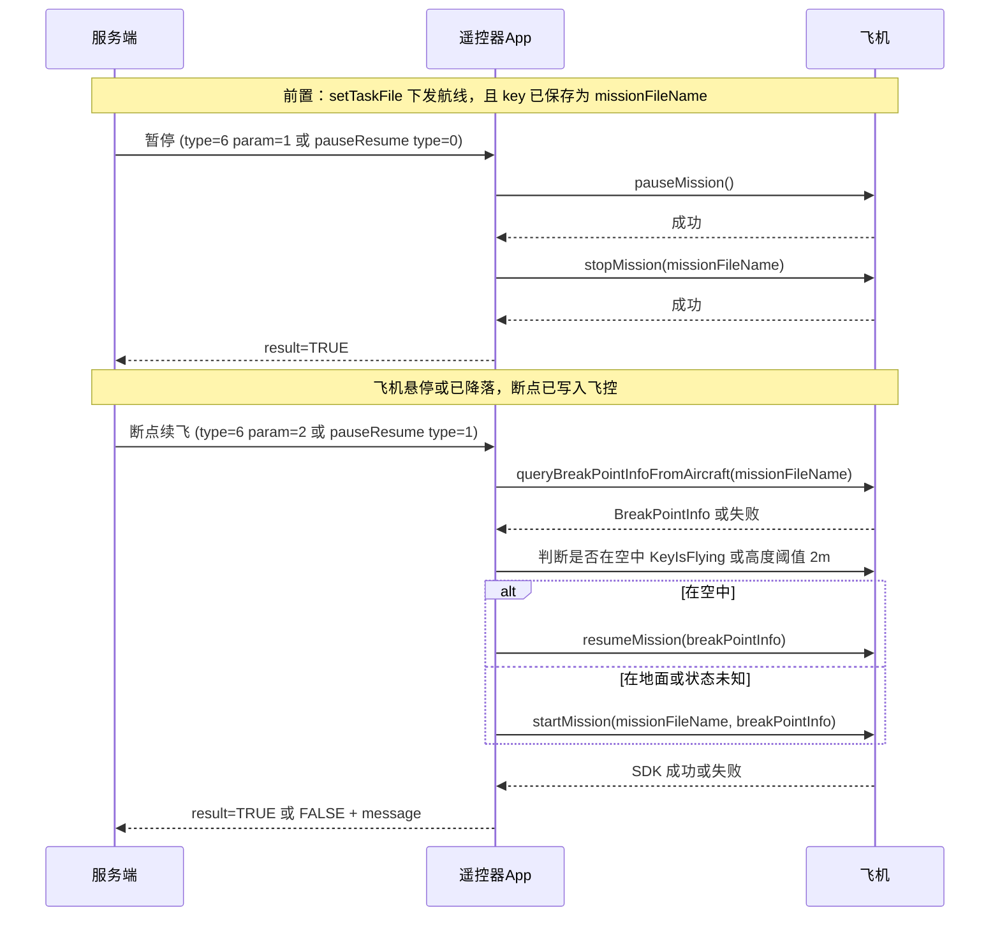

# 断点续飞 MQTT 协议与流程说明

本文档依据样例工程实现整理，对应代码：

- [MissionControlService.kt](cleanGun/SampleCode-V5/android-sdk-v5-sample/src/main/java/dji/sampleV5/aircraft/mqtthandle/MissionControlService.kt)
- [MqttMessageHandler.kt](cleanGun/SampleCode-V5/android-sdk-v5-sample/src/main/java/dji/sampleV5/aircraft/mqtthandle/MqttMessageHandler.kt)
- [UavControlResponse.kt](cleanGun/SampleCode-V5/android-sdk-v5-sample/src/main/java/dji/sampleV5/aircraft/data/UavControlResponse.kt)
- [MessageParser.kt](cleanGun/SampleCode-V5/android-sdk-v5-sample/src/main/java/dji/sampleV5/aircraft/mqtthandle/MessageParser.kt)（`TaskFileRequest`）

---

## 1. 前置条件（服务端必须先满足）

| 条件 | 说明 |
|------|------|
| 已下发航线任务 | 通过主题 **`/api/work/setTaskFile_{key}`** 下发 KMZ/任务；解析后的 **`TaskFileRequest.key`** 会被 App 保存为 **`currentMissionFileName`**（即后续所有航线控制使用的「任务文件名」）。 |
| 同一 `key` 主题后缀 | 控制类主题里的 `{key}` 与 setTaskFile 使用同一设备/会话标识，与配置一致。 |
| 曾执行过航线并有断点 | 断点由飞控/航线模块在暂停或中断后记录；若从未执行、或飞机侧无对应记录，**查询断点会失败**。 |

**若 `currentMissionFileName` 为空**（未成功走 setTaskFile 或未带上 `key` 字段），暂停、断点续飞、终止等航线相关指令会直接返回失败，提示需先 setTaskFile。

---

## 2. 两条 MQTT 入口（功能等价、可任选其一）

### 2.1 入口 A：统一 UAV 控制（推荐与拍照/返航等共用）

- **订阅（App 收指令）**：`/api/machine/uav/control_{key}`
- **请求体**：`UavControlRequest`

| 字段 | 类型 | 说明 |
|------|------|------|
| `key` | string? | 与主题中的 key 对应（可选，视你们协议） |
| `tid` | string? | **必填**，事务 ID；缺失时 App 不处理 |
| `type` | int? | **6** = 航线控制 |
| `parameter` | int | **1** 暂停；**2** 断点续飞；**3** 终止并悬停；**4** 终止并按策略返航 |

**注意**：`type` 为 `null` 或 `0` 时，App 会当作无效/响应包忽略，不进入业务。

### 2.2 入口 B：独立暂停/断点续飞主题

- **订阅（App 收指令）**：`/api/work/pauseResumeMission_{key}`
- **请求体**：`PauseResumeMissionRequest`

| 字段 | 类型 | 说明 |
|------|------|------|
| `key` | string | 与主题 key 一致 |
| `tid` | string | **必填** |
| `type` | int | **0** = 暂停；**1** = 断点续飞 |

**防循环**：若 payload 中含 `result` 字段，App 会忽略该条（避免把己方响应当请求再处理）。

---

## 3. 响应格式（App 发布）

App 通过 `MqttManager.publish(api, json)` 回包，结构与 `UavControlResponse` 一致：

| 字段 | 说明 |
|------|------|
| `key` | 与请求中的设备 key 一致 |
| `tid` | 与请求 tid 一致 |
| `api` | **发布主题**：入口 A 为 `/api/machine/uav/control_{key}`；入口 B 为 `/api/work/pauseResumeMission_{key}` |
| `message` | 文本说明（成功/失败原因） |
| `result` | **`TRUE`** / **`FALSE`** |

---

## 4. 断点续飞完整流程（含暂停）



### 4.1 「暂停」在代码里的真实含义

实现上 **不是** 仅调用 `pauseMission`：

1. `WaypointMissionManager.pauseMission` 成功回调后，会立刻再调 **`stopMission(missionFileName)`**。
2. 目的：退出当前航线执行并落盘断点，便于后续从断点恢复。

### 4.2 「断点续飞」在代码里的分支

1. **`queryBreakPointInfoFromAircraft(missionFileName)`** 必须成功且 `BreakPointInfo` 非空。
2. **`isAircraftInAir`**：
   - 优先 `FlightControllerKey.KeyIsFlying`；
   - 失败则用 `KeyAircraftLocation3D` 高度 **> 2 m** 视为空中；
   - 若仍无法判断（`null`），**按地面路径处理**（更安全）：走 **`startMission(missionFileName, breakPointInfo)`**，**不会**先调 `stopMission`（与早期「先 stop 再 start」不同）。

---

## 5. 服务端需要发什么（最小步骤）

1. **先** `POST` 到 MQTT：`/api/work/setTaskFile_{key}`，且 JSON 里 **`key` 字段** 与后续航线控制使用的任务名一致（该值即飞机侧查询断点用的 `missionFileName`）。
2. 飞机执行航线过程中需要中断时，发 **暂停**（入口 A `type=6, parameter=1` 或入口 B `type=0`）。
3. 需要继续时，发 **断点续飞**（入口 A `type=6, parameter=2` 或入口 B `type=1`）。
4. 每次请求带 **唯一 `tid`**，用于与响应关联。

---

## 6. 何时会成功 / 何时会失败

### 6.1 成功（逻辑上）

- 已 setTaskFile 且 `key` 已保存；
- 飞控侧存在该 `missionFileName` 对应的 **有效断点**；
- 空中分支：`resumeMission(breakPointInfo)` SDK 回调成功；
- 地面/未知分支：`startMission(missionFileName, breakPointInfo)` SDK 回调成功。

### 6.2 失败（App 直接返回或 SDK 失败）

| 场景 | 典型 `message` / 原因 |
|------|-------------------------|
| 未 setTaskFile 或 key 为空 | 「无法获取任务文件名，请先通过 setTaskFile 下发任务文件」 |
| 查询断点失败 | 「查询断点信息失败: …」或「未找到断点信息」 |
| `missionFileName` 与飞机记录不一致 | 查不到断点或恢复失败 |
| 飞机未连接、航线未上传、SDK 错误 | `pauseMission` / `stopMission` / `resumeMission` / `startMission` 失败描述 |
| 入口 A `tid` 为空 | App **不回复**（直接 return） |
| 入口 A `type` 为 null 或 0 | 被忽略（防响应回环） |
| 入口 B payload 含 `result` | 被忽略 |
| 未知 `parameter` 或未知 `type` | 「未知的航线控制参数」/「未知的断点续飞类型」 |

以下为**常见业务/SDK 层**失败（实现未逐条映射错误码，需结合日志与 DJI 文档）：

- 从未执行过该航线就发续飞；
- 飞机重启或任务被清空导致无断点；
- GPS/卫星不足、限飞、低电量策略拦截；
- 航线高度、偏航角等与当前状态不满足 `startMission`/`resumeMission` 校验。

---

## 7. JSON 示例

以下 `{key}`、`{tid}` 请替换为实际值；`key` 在 setTaskFile 与后续控制中应代表**同一任务文件名标识**。

### 7.1 setTaskFile（前置，节选）

**主题**：`/api/work/setTaskFile_{key}`

```json
{
  "key": "my_mission_001",
  "tid": "550e8400-e29b-41d4-a716-446655440000",
  "fileUrl": "https://example.com/path/to/mission.kmz",
  "taskType": 0,
  "taskId": "task_20260101_001",
  "autoUpload": true,
  "returnHeight": 30.0,
  "totalPoint": 10,
  "api": "/api/work/setTaskFile_device01"
}
```

说明：App 使用 **`request.key`**（此处 `my_mission_001`）作为 `currentMissionFileName`，**不是**从 `fileUrl` 截取文件名（除非你们约定 key 与 KMZ 内名称一致）。

### 7.2 入口 A：暂停

**主题**：`/api/machine/uav/control_{key}`

```json
{
  "key": "device01",
  "tid": "550e8400-e29b-41d4-a716-446655440001",
  "type": 6,
  "parameter": 1
}
```

### 7.3 入口 A：断点续飞

```json
{
  "key": "device01",
  "tid": "550e8400-e29b-41d4-a716-446655440002",
  "type": 6,
  "parameter": 2
}
```

### 7.4 入口 B：暂停 / 断点续飞

**主题**：`/api/work/pauseResumeMission_{key}`

暂停：

```json
{
  "key": "device01",
  "tid": "550e8400-e29b-41d4-a716-446655440003",
  "type": 0
}
```

断点续飞：

```json
{
  "key": "device01",
  "tid": "550e8400-e29b-41d4-a716-446655440004",
  "type": 1
}
```

### 7.5 响应示例（成功）

```json
{
  "key": "device01",
  "tid": "550e8400-e29b-41d4-a716-446655440002",
  "api": "/api/machine/uav/control_device01",
  "message": "航线继续成功",
  "result": "TRUE"
}
```

### 7.6 响应示例（失败）

```json
{
  "key": "device01",
  "tid": "550e8400-e29b-41d4-a716-446655440002",
  "api": "/api/machine/uav/control_device01",
  "message": "查询断点信息失败: ...",
  "result": "FALSE"
}
```

---

## 8. 实现备注（供对照代码）

- `MissionControlService.resumeMission()` 仅为占位（直接 `onSuccess`），**MQTT 断点续飞实际走 `resumeMissionFromBreakpoint`**，请勿混淆。
- 终止航线：`parameter=3` 仅 `stopMission`；`parameter=4` 为 `stopMission` 成功后调用返航逻辑（见 `FlightControlService`）。

---

**文档版本**：与仓库内上述 Kotlin 文件行为一致；若后续改动暂停/续飞串联逻辑，请同步更新本文档。
